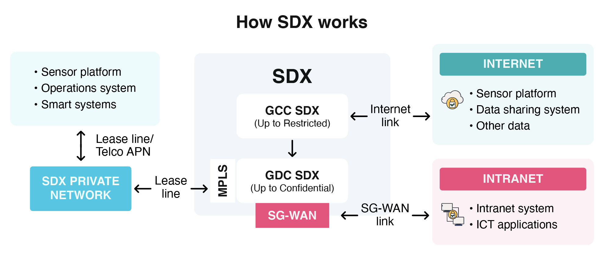
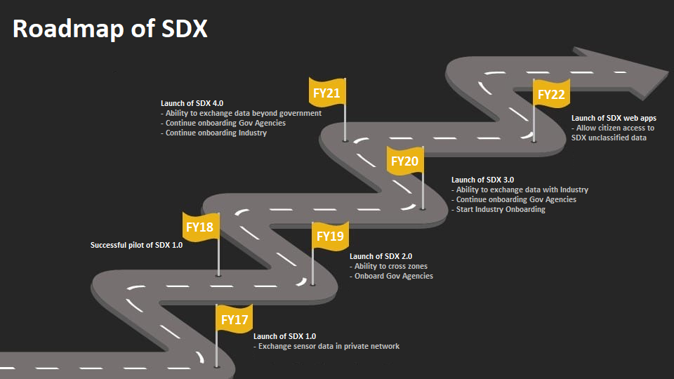

## Sensor Data Exchange (SDX)

### Overview

SDX is part of Smart Nation Sensor Platform (SNSP), a Strategic National Project. It is a centralised platform that distributes sensor data across Whole-of-Government (WOG). It provides seamless and secure data sharing and management, and encompasses public, private, and industrial internet-of-things.

SDX enables government agencies to:

- Publish and subscribe (near) real-time sensor data using a self-service portal both government intranet and government commercial cloud.

- Share unclassified (potentially up to restricted) sensor data with government sector organisations

An illustration of the components of SDX and its ability to distribute sensor data across networks:

### Features

- **Sensor marketplace:** Publish and subscribe to data across government agencies for comprehensive insights

- **Support multiple protocols:** MQTT, AMQP, REST, and so on

- **Data transfer in real-time:** Enable sensor data to be distributed across government agencies in real-time for timely responses and predictive analytics

- **Data sharing across network zones:** Secure cross-zone data exchange across internet, intranet, and private networks

- **Self-service portal:** Along with workflow engine

- **Data sharing and ingestion on internet**

### Key benefits

- Exchange as a service

  - Subscription based

  - No heavy investment in infrastructure

  - Manage core infrastructure and MPLS circuit to the perimeter of agency network

- Robust architecture for smart systems

  - Versatile in supporting event-driven distributed data and unpredictable workload

  - Ability to abstract and distribute data

  - Manage technical complexity of cross zone integration and protocol translation

* Spur innovation

  - Ease to equip data scientist with data that is not readily available in their agency

  - Create a culture of sharing for innovation to flourish

### Upcoming plans

### Get Started

Administrative access to SDX is available [here](https://sdx.sensors.gov.sg/sdx/home).

To find out more about SDX or the onboarding process, contact [sense@tech.gov.sg](mailto:sense@tech.gov.sg).
